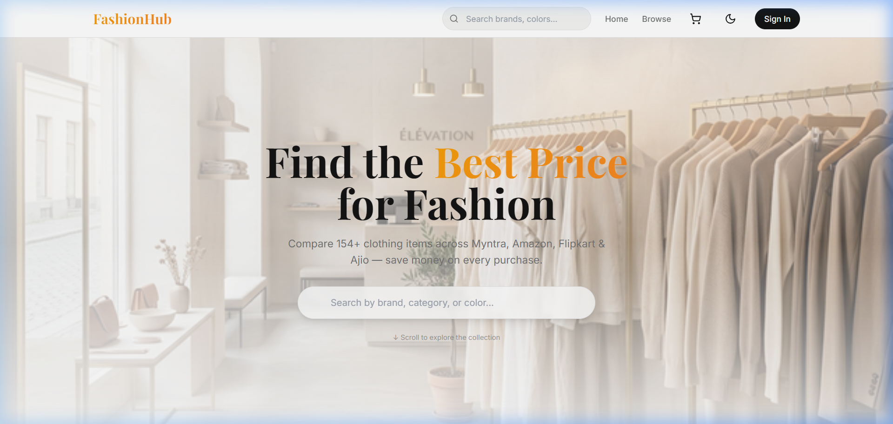
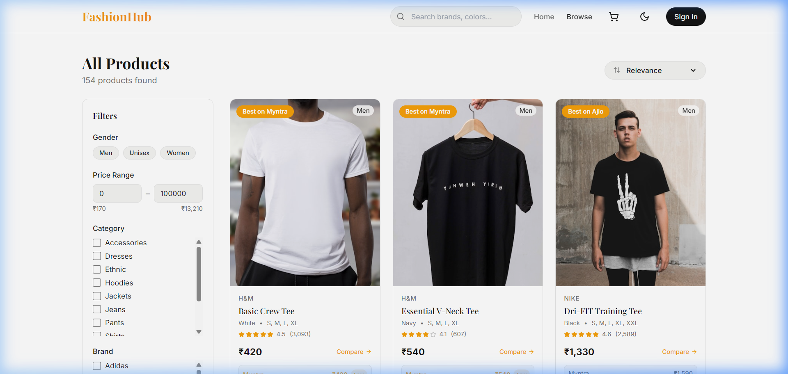
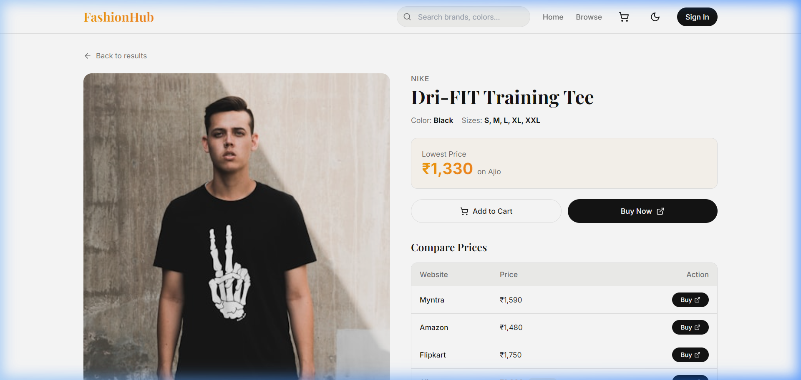
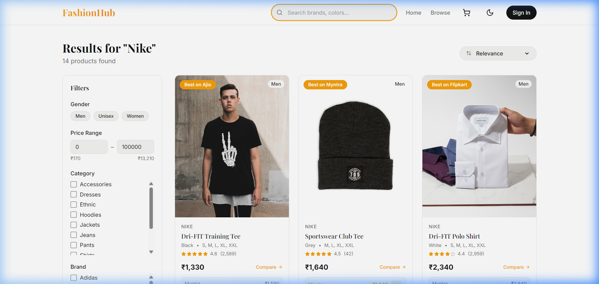
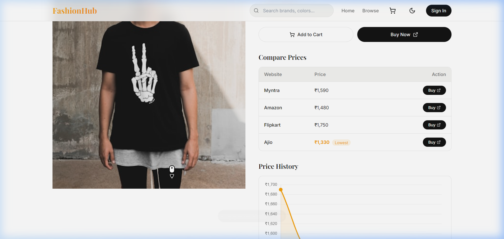

  

# Institute of Engineering and Technology (IET)

## Minor Project Mid-Term Report

## Project Title: FashionHub – Clothing Aggregator Website

---

**PREPARED BY**
Chetesh Sharma – 2023BCA007
Karan Morya – 2023BCA015
Khush Jewariya – 2023BCA016

 

**FACULTY GUIDE**
Mr. Divanshu Jain

 

**March 2026**

---

## TABLE OF CONTENTS

1. Abstract
2. Introduction
3. Problem Statement
4. Methodology and Theoretical Background
5. Architecture and Key Design Decisions
6. Work Completed Till Mid-Term
   - 6.1 Research and Design
   - 6.2 Backend
   - 6.3 Frontend
7. Plan For Remaining Project Timeline
8. Risks and Mitigation Strategies
9. Appendix
   - A.1: Future Work
   - A.2: References

---

 

## 1. Abstract
FashionHub is an innovative clothing aggregator platform envisioned to streamline the overall online shopping experience. This project consolidates varying clothing products from multiple leading online retail platforms. This report presents the ongoing development of FashionHub, highlighting its core functionalities such as enabling users to efficiently browse, systematically compare prices, and seamlessly redirect to original websites for purchasing. Our principal objective is to provide a time-efficient, cost-effective tool. Currently, the implementation leverages HTML, CSS, JavaScript alongside a modern front-end structure (VS Code and GitHub), with future expansions aiming towards real-time advanced functionality.

## 2. Introduction
The e-commerce landscape is drastically fragmented, with clothing variations dispersed across thousands of platforms. This causes substantial disruption during comparative shopping for consumers. FashionHub addresses this challenge by functioning as an aggregator that intelligently brings together categorized fashion items into a highly unified and organized interface. This project emphasizes leveraging front-end capabilities in gathering product datasets to natively offer sorted listings, search functionalities, and direct price comparisons, definitively enhancing accessibility and consumer decision-making.

## 3. Problem Statement
Online shoppers frequently face considerable difficulty tracking the absolute best deals while uncovering distinct clothing styles individually due to decentralization among various modern e-commerce websites. Currently, a consumer must manually transverse multiple disjoint platforms to compare similar clothing items, which proves extraordinarily inefficient. FashionHub natively resolves this concern by providing an intelligent centralized mechanism that curates extensive clothing data matrices—allowing analytical comparisons of market pricing and simplifying the core discovery phase for buyers.

## 4. Methodology and Theoretical Background
The life cycle of the FashionHub project predominantly follows an Iterative Agile methodology, verifying constant integration and evaluation parameters. The initial foundational phase emphasized strict requirement analysis paired with extensive UI/UX framework design, firmly establishing a responsive layout. We utilized front-end architectures strictly focusing on reusable components, optimizing workflow execution. The fundamental theorem of our development resides strongly within data aggregation logic combined heavily with client-side comparative data state management to distinctly exhibit variations in global product pricing. 

## 5. Architecture and Key Design Decisions

**High Level System Design**
The overall architecture adopts a client-oriented visualization model. Our frontend dynamically incorporates local static data matrices (JSON structural hierarchies representing the products) to adequately simulate backend aggregation schemas. Through systematic user interactions, the architecture initiates subsequent comparative logic prior to safely redirecting to precise e-commerce nodes.

**Tech Stack**
- **Core Technologies Used:** HTML, CSS, JavaScript
- **Development Environment:** VS Code
- **Version Control & Collaboration:** GitHub

**Additional Design**
The User Experience (UX) journey has been architected to minimize cognitive overload, ensuring that product discovery through search paradigms requires the minimal viable clicks required to successfully redirect users to purchasing platforms.

## 6. Work Completed Till Mid-Term

### 6.1 Research and Design
- Executed comparative analysis on extant software tools for content aggregation optimizations.
- Delivered foundational wireframes alongside finalizing comprehensive typography and uniform UI aesthetics.
- Secured initial responsive framework strategies assuring multi-device mobile compatibility.

### 6.2 Backend
- Constructed mock architectural backend prototypes via detailed structured datasets, serving as reliable placeholders for immediate evaluation.
- Developed preliminary static models encompassing vital attributes such as product imagery, relative titles, standard pricing metrics, and origin vendor redirections.

### 6.3 Frontend
- Strategically completed initial responsive UI implementation utilizing scalable CSS combined natively with interconnected JavaScript elements.
- Implemented core exploratory interactions for intuitive categorization of diverse clothing styles.

**Pictorial Representation of work**

*Figure 1: Home Page*

*Figure 2: Product Listing Page*

*Figure 3: Product Details Page*

*Figure 4: Search Page*

*Figure 5: Price Comparison Page*

## 7. Plan For Remaining Project Timeline
The sequential phase of development will predominantly focus on refining front-end operational capabilities alongside expanding the data filtration framework to seamlessly encompass broader multi-platform comparisons. Additional emphasis will be placed upon rigorous functional UI testing to optimize structural responsiveness scaling and layout stabilization. Following immediate goals, expansive technical upgrades outline our future trajectory.

## 8. Risks and Mitigation Strategies
**Risk:** Data representation delays or interface clutter upon rapid dataset incrementation.
- *Mitigation:* Phased integration of modular formatting optimizations (e.g., streamlined list generation via localized JavaScript mapping) restricting memory overheads.

**Risk:** Operational downtime from disjoint origin URL nodes.
- *Mitigation:* Implementing a routine structural audit validation process testing explicit redirect pathways effectively.

## 9. Appendix

### A.1: Future Work
Upon establishing current architectural iterations, extensive integration of structural enhancements is systematically mapped to fundamentally mature operations:
- **API Integration:** Transitioning from primary static architecture into dynamic third-party integrations natively connecting via varied RESTful APIs.
- **Real-time Price Comparison:** Empowering active polling algorithms directly capturing updated variations encompassing dynamic discounts or flash sales realistically.
- **Backend Database:** Deploying robust server-side infrastructures ensuring dedicated, durable remote storage of significantly massive data parameters across secure pathways.
- **User Authentication:** Encompassing specialized user account systems facilitating active logging—allowing features precisely like wishlist formulation, comparative price-tracking timelines, and secured personalized notifications.

### A.2: References
- Reference to standardized HTML/CSS Documentations.
- Core reference libraries encapsulating modern JavaScript integration workflows.
- Extraneous documentation regarding GitHub implementation procedures standardly documented.
